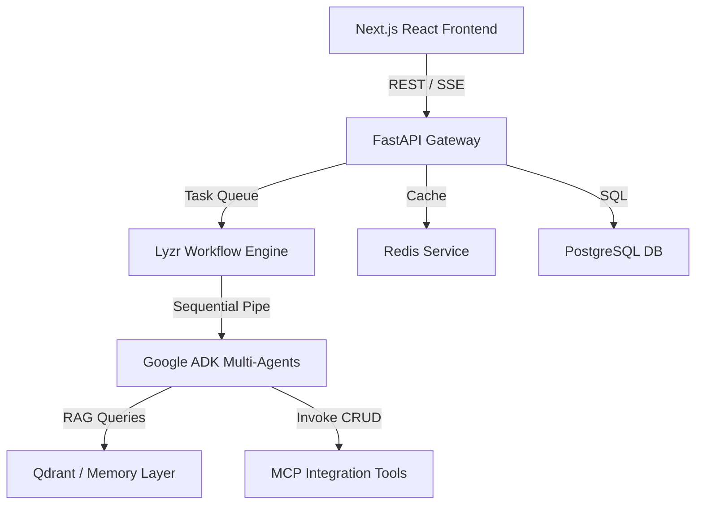

# HackLaunch AI — Multi-Agent Hackathon GTM Launch Platform

HackLaunch AI is a production-grade multi-agent event orchestration and Go-To-Market (GTM) launch package builder. Built using **Google Agent Development Kit (ADK)**, **Lyzr Agent Framework**, **FastAPI**, **Next.js**, and **Qdrant**, it enables automatic generation, indexing, and integration of event assets.

---

## 🏗️ Architecture Overview



### 1. Multi-Agent Orchestrators
- **Google ADK Layer**: Implements 8 customized agents bound with 40 async CRUD tools across 10 communication/workspace/productivity platforms.
- **Lyzr Workflow Engine**: Coordinates sequential execution of the GTM pipeline (Planner -> Marketing -> Landing Page -> Email -> Sponsor -> Budget -> Execution -> Memory) with transient retry queues and failure recovery logs.

### 2. Long-Term Memory & RAG
- **Qdrant DB & Cosine Similarity Fallback**: Stores event idea documents, preferences, and conversations.
- **Retrieval-Augmented Generation (RAG)**: Automatically embeds prompts with text-embedding-004 and fetches matches to enrich Gemini Pro/Flash generations.

### 3. Model Context Protocol (MCP) CRUD Tools
- Exposes 40 async CRUD operations across 10 platforms: Google Calendar, Docs, Sheets, Drive, Gmail, Slack, Discord, GitHub, Notion, Figma.

---

## 🚀 Quick Start Guide

### 1. Prerequisites
- Docker & Docker Compose
- Node.js v18+ (for local frontend dev)
- Python 3.10+ (for local backend dev)

### 2. Environment Setup
Clone the configuration example to create your local `.env`:
```bash
cp backend/.env.example backend/.env
# Set your GEMINI_API_KEY inside backend/.env
```

### 3. Launching via Docker Compose (Production Stack)
To run the full stack (PostgreSQL, Redis, Qdrant, FastAPI, Next.js, Nginx):
```bash
docker-compose -f docker-compose.prod.yml up --build -d
```
The application will be accessible at:
- Frontend Client: `http://localhost`
- API Backend docs: `http://localhost/docs` (only in development/staging)
- Vector DB Dashboard: `http://localhost:6333/dashboard`

---

## 📝 API Endpoints Summary

### 1. Workflows
- `POST /api/v1/workflows/lyzr/run`: Trigger GTM generation pipeline.
- `GET /api/v1/workflows/lyzr/{workflow_id}`: Track status, progress, logs, and outputs.

### 2. Semantic Memory
- `POST /api/v1/memory/search`: Semantic vector query over collections.
- `POST /api/v1/memory/save`: Seed a new memory item directly.

### 3. Exports
- `GET /api/v1/export/{event_id}/pdf`: Download ReportLab GTM PDF Booklet.
- `GET /api/v1/export/{event_id}/docx`: Download Word document.
- `GET /api/v1/export/{event_id}/certificate`: Download PDF Participation certificate.
